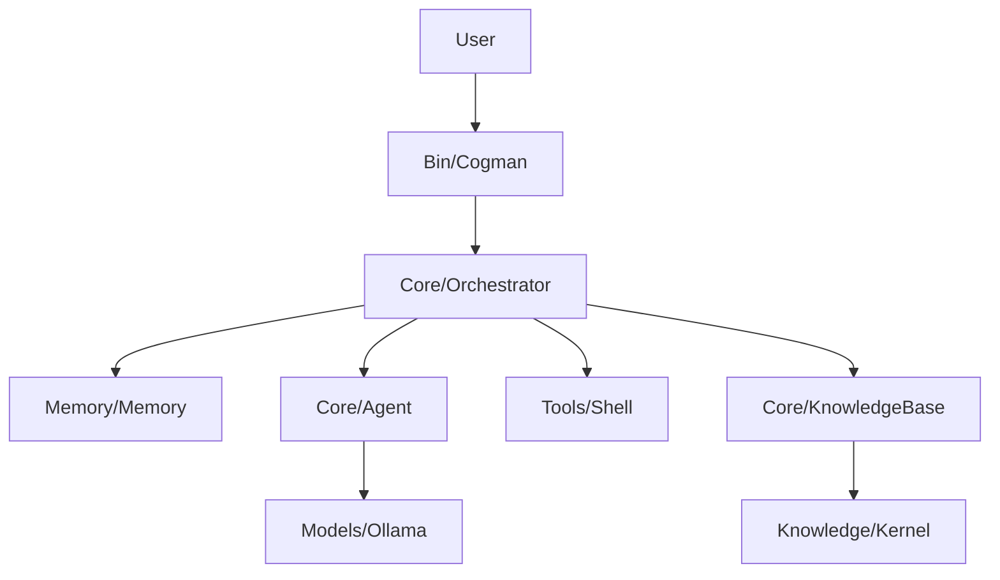

# Penguide - Your Linux & Kernel Guide

Penguide is an educational autonomous agent designed to help beginners learn Linux command-line operations while understanding the underlying Linux Kernel concepts. It translates user queries into safe shell commands, provides clear explanations, and references official-style kernel documentation.

## Architecture



- **Educational Orchestrator**: Manages the teaching loop, combines memory with kernel documentation snippets.
- **Knowledge Base**: Curated snippets of Linux Kernel documentation used to "train" the agent's context.
- **Interactive Guide**: Explains commands *before* execution to ensure the user learns the system.

## Key Features

- **Teaching First**: Every command is explained in simple terms.
- **Kernel Insights**: Automatically links user tasks to kernel subsystems (Memory, Processes, etc.).
- **Safe Sandbox**: Executes commands within a strict, permit-list policy.
- **Persistent Learning**: Multi-turn memory allows the user to ask follow-up questions.

## Getting Started

### Installation

1. **Install [Ollama](https://ollama.ai/).**

2. **Pull a model.** Default is Mistral (~4.5 GiB RAM). If you have less memory, use a smaller model:
   ```bash
   ollama pull mistral          # default, needs ~4.5 GiB RAM
   ollama pull phi              # smaller, ~1.6 GiB
   ollama pull tinyllama        # very small, ~0.5 GiB
   ```

3. **Python dependencies** — use a virtual environment (recommended on Linux, especially Arch):
   ```bash
   cd /path/to/penguide
   python3 -m venv .venv
   source .venv/bin/activate    # Linux/macOS; on Windows: .venv\Scripts\activate
   pip install -r requirements.txt
   ```
   *(Note: use `pip install -r requirements.txt` with `-r`, not `pip install requirements.txt`.)*

### Usage

Start the guide (with venv activated):
```bash
python3 bin/penguide.py
```

**If you use a smaller model**, set it before running:
```bash
export OLLAMA_MODEL=phi        # or tinyllama, etc.
python3 bin/penguide.py
```

Example queries:
- "How do I see running processes?"
- "What does the kernel do with memory?"
- "Explain the difference between `ls` and `pwd`."

## Project Structure

- `bin/`: CLI entry point.
- `core/`: Agent logic, Orchestrator, and Knowledge Base.
- `knowledge/kernel/`: Sample kernel documentation files.
- `configs/`: Security policies, central settings (env).
- `memory/`: Conversation history (in-memory).
- `models/`: Ollama client.
- `tools/`: Shell runner and tool registry.
- `docs/`: Global documentation (end-to-end flow, training).
- `docs/presentations/`: Slides, conference decks, evaluation PDFs & screenshots.
- `scripts/`: Dataset fetch and TensorFlow training (optional; run training on another machine).

## Documentation

- **[docs/GLOBAL.md](docs/GLOBAL.md)** — End-to-end architecture, data flow, configuration, security.
- **[docs/TRAINING.md](docs/TRAINING.md)** — Fetching training data and running TensorFlow training on another laptop.
- **[docs/CONFERENCE_PAPER.md](docs/CONFERENCE_PAPER.md)** — Full conference paper (academic description, related work, design, implementation, evaluation directions).

## Optional: Training (on another laptop)

1. Fetch data: `python scripts/fetch_training_data.py` (writes `data/training_pairs.jsonl`).
2. Copy `data/` and `scripts/` to the other machine, then: `pip install -r requirements-training.txt` and `python scripts/train_tensorflow.py --out ./saved_model`.

---
*Created for Final Year Project - Focused on Educational AI in Linux Systems.*
