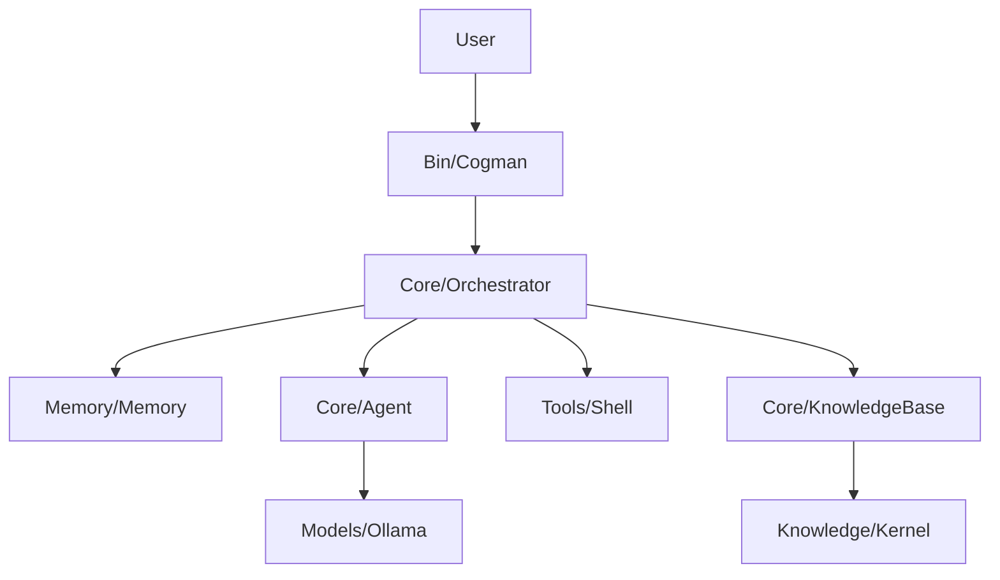

# Penguide - Your Linux & Kernel Guide

Penguide is an educational autonomous agent designed to help beginners learn Linux command-line operations while understanding the underlying Linux Kernel concepts. It translates user queries into safe shell commands, provides clear explanations, and references official-style kernel documentation.

## Architecture



- **Educational Orchestrator**: Manages the teaching loop, combines memory with kernel documentation snippets.
- **Knowledge Base**: Curated snippets of Linux Kernel documentation used to "train" the agent's context.
- **Interactive Guide**: Explains commands *before* execution to ensure the user learns the system.

## Key Features

- **Teaching First**: Every command is explained in simple terms.
- **Kernel Insights**: Automatically links user tasks to kernel subsystems (Memory, Processes, etc.).
- **Safe Sandbox**: Executes commands within a strict, permit-list policy.
- **Persistent Learning**: Multi-turn memory allows the user to ask follow-up questions.

## Getting Started

### Installation

1. Install [Ollama](https://ollama.ai/).
2. Pull a model: `ollama pull mistral`.
3. Check dependencies:
   ```bash
   pip install -r requirements.txt
   ```

### Usage

Start the guide:
```bash
python3 bin/penguide.py
```

Example queries:
- "How do I see running processes?"
- "What does the kernel do with memory?"
- "Explain the difference between `ls` and `pwd`."

## Project Structure

- `bin/`: CLI entry point.
- `core/`: Agent logic, Orchestrator, and Knowledge Base.
- `knowledge/kernel/`: Sample kernel documentation files.
- `configs/`: Security policies and shell restrictions.

---
*Created for Final Year Project - Focused on Educational AI in Linux Systems.*
